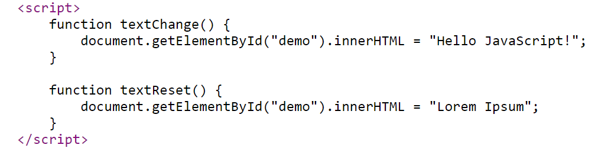

# Instructions  

  ** FIND THE DEFINITION OF**

  * _Variable_
  * _Sequence_
  * _Input_
  * _Output_

  ## Requirements
  1. Input
  2. OutPut
  3. Variable
  4. Function
  5. Add CSS to the page

  

  For example,:

  
  
  